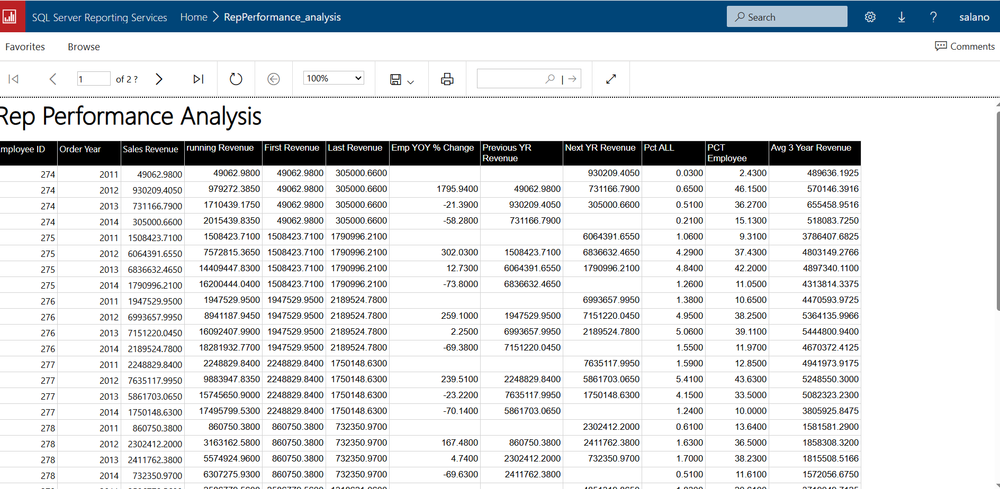

This repository contains SQL snippets demonstrating key SQL concepts

Concepts covered:

- case statements
- aggregationin cluding having clause
- common table expression (CTE)
- union
- window functions

  - running totals
  - row number
  - first value
  - last value
  - max
  - window and overall percentage

  SSRS Report - Performance Analysis Report (multiple windows function)
  

  SSRS Report - Performance Report
  

  SSRS Report - Performance Report YOY growth
  
