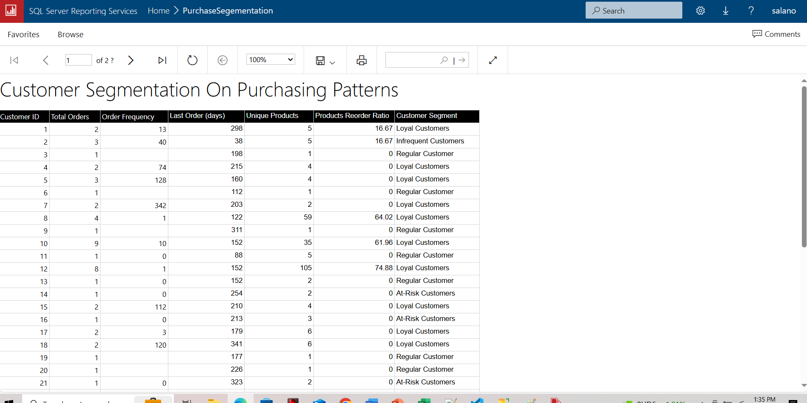

This repository contains SQL snippets demonstrating key SQL concepts

Concepts covered:

- case statements
- aggregationin cluding having clause
- common table expression (CTE)
- union
- window functions

  - running totals
  - YOY change
  - row number
  - first value
  - last value
  - max
  - window and overall percentage

  SSRS Report - Performance Analysis Report (multiple windows function)
  

  SSRS Report - Performance Report
  

  SSRS Report - Performance Report YOY growth
  

  SSRS Report - Customer Segementation by Purchasing Pattern
  

Using the AdventureWorkd Database, we can segment customers based on columns like:

1.) Number of Orders: Total number of orders placed by a customer.

2.) Frequency of Purchase: How often a customer places orders.

3.) Last Purchase (Recency): Days since last purchase.

4.) Unique products: How many types of products purchased.

5.) Product Preferences (Diversity): Types of products frequently purchased.

Using the NTile (Creating 4 groups) windows functions on the above columns,
we can label the segments using a group rank >=3 for high and <= 2 for low:

1.) Loyal Customers:

High total orders >=3, high purchase frequency >=3, low recency <=2.

Example: Customers who shop frequently and recently.

2.) At-Risk Customers:

High recency >=2, low purchase frequency <=2.

Example: Customers who haven’t shopped in a while.

3.) New Customers:

Low total orders <=2, low product diversity <=2.

Example: Customers who have placed only a few orders.

4.) Bulk Buyers:

High total orders >=3, high product_diversity >=3.

Example: Customers who buy large quantities or a variety of products.

5.) Regular Customers:

Orders not meeting the above criteria.

Example: Customers with no defined purchase pattern.

Action to Take

Loyal Customers: Offer loyalty rewards or exclusive discounts.

At-Risk Customers: Send re-engagement emails/texts or special offers.

New Customers: Provide welcome discounts or product recommendations.

Bulk Buyers: Offer bulk discounts or subscription plans.

Regular Customers: Send special offers or discounts.
